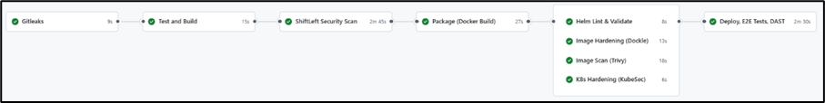

# HW2-BuildWorkflow

## 專案介紹

這個專案是一個使用 Python 和 FastAPI 的簡單 Web 服務，提供問候 API。專案同時包裝 Docker 映像與 Helm Chart，並透過 GitHub Actions 建置與安全掃描流程實現 CI/CD。

### 主要功能

- `POST /hello`：接收 JSON 格式請求並回傳問候訊息。
- `GET /health`：回傳應用健康檢查狀態。
- 單元測試：使用 `pytest` 測試 API 行為。
- Docker 化：建置最小化 Python 映像。
- Helm Chart：部署至 Kubernetes 的模板配置。
- GitHub Actions：包含程式碼掃描、測試、容器掃描、Helm 檢查、Kind 部署與 E2E 測試。

## 專案技術

- 程式語言：Python 3.12
- Web 框架：FastAPI
- 資料驗證：Pydantic
- 測試工具：pytest
- Web 伺服器：Uvicorn
- 容器化：Docker
- Kubernetes 部署：Helm
- CI/CD：GitHub Actions

## 專案結構

- `Dockerfile`：建立應用映像的指令。
- `requirements.txt`：Python 相依套件。
- `pyproject.toml`：Python 打包配置。
- `src/main/app.py`：FastAPI 應用程式主體。
- `src/main/model.py`：Pydantic 模型定義。
- `src/test/u_test.py`：pytest 測試案例。
- `helm/myapp/`：Helm Chart 資料夾。
- `.github/workflows/devsecops.yml`：GitHub Actions CI/CD 工作流程。

## 開發與執行方式

### 1. 建立虛擬環境

```bash
python -m venv venv
.\
venv\Scripts\activate
```

### 2. 安裝套件

```bash
pip install --upgrade pip
pip install -r requirements.txt
```

### 3. 本機執行

```bash
uvicorn src.main.app:app --host 0.0.0.0 --port 8000
```

訪問：
- `http://localhost:8000/health`
- `http://localhost:8000/docs`（FastAPI 自動產生文件）

### 4. 執行測試

```bash
pytest
```

### 5. 建置 Docker 映像

```bash
docker build -t myapp:latest .
```

### 6. 使用 Helm 部署（本地測試）

```bash
helm install myapp ./helm/myapp --set image.repository=myapp --set image.tag=latest --set image.pullPolicy=Never
```

## GitHub Actions CI/CD 流程

`.github/workflows/devsecops.yml` 定義了以下工作：



1. Gitleaks 檢查敏感資訊。
2. 安裝相依套件並執行 `pytest`。
3. ShiftLeft 靜態安全掃描。
4. Image 建置與儲存 (Docker)。
5. Helm Lint 與模板驗證。
6. Image 最佳實務檢查（Dockle）。
7. Image 的 CVE 漏洞掃描（Trivy）。
8. Kubernetes Helm 模板安全掃描（KubeSec）。
9. 在 kind 叢集部署
10. 執行簡單 E2E 測試。
11. 使用 OWASP ZAP 進行 DAST 掃描。

## 其他說明

- `src/main/model.py` 定義了請求與回應資料模型。
- `Dockerfile` 採用 multi-stage 建置，提升映像精簡性與安全性。
- `helm/myapp/values.yaml` 定義部署參數，包括服務類型、健康檢查與資源限制。

---
